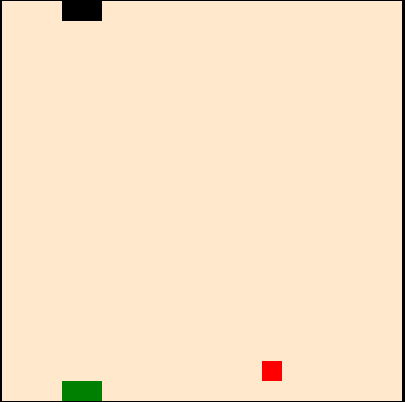

# Notes and Code from POODR

This a repo to collect the notes and code from reading Practice Object-Oriented
Design in Ruby by Sandi Metz.

## Why POODR?
I'm reading POODR because I want to be a better software engineer. I've watched
several of Sandi Metz's talks from various Ruby conferences and she presents
principles and techniques to help engineers write software that is designed to
be easy to maintain and easy to change. These are the goals behind
Object-Oriented Design(OOD).

This is a series of posts that goes through chapters 2 through 9 of POODR trying
to explain the principles learned through the refactoring a two player snake
game I wrote in JavaScript. [Play the game here](http://emmanuelgenard.com/two_snake/) and
[check out the repo](https://github.com/edgenard/two_snake). I'm also keeping
notes on each chapter [here](https://github.com/edgenard/poodr/tree/master/notes) these mostly to make sure I actually understand what I read.

I don't think it should matter I'm refactoring a JavaScript code because these
principles of Object-Oriented Design should apply to any language where Object-Oriented Programming is possible. I'm  aiming to do three things:

* Apply each chapter's principle to all three classes in the game, `Snake`,
`Board` and `Snake-View`.
*  Go through one chapter a week, including all the refactoring and the post talking about it.(Ambitious)
* Add new features. (Super Ambitious)


## How to Design a Class with a Single Responsibility
We are going to refactor an already built snake game. Seeing if we can improve
the organization of the code to make it easy to change.

The game is broke up into three classes, Snake, Board, Snake-View. The game
works fine now but I want to add some new features and I would like to make it
easy to change.

Lets look at the snake class and what it does

```javascript
    (function () {
      "use strict";
      if ( typeof Snake === "undefined") {
          window.Snake = {};
      }

      var snake = Snake.snake = function (options) {
        this.dir = "E";
        this.segments = options.startingPos;
        this.color = options.color;
        this.score = 0;
        this.shortcuts = options.shortcuts.join(", ");
        key(this.shortcuts, this.turn.bind(this));

      };

      snake.prototype.move = function () {
        this.segments.shift();
        this.addSegment();

      };

      snake.prototype._dup = function (arr) {
        var newArr = [];
        arr.forEach(function(el, i){
          newArr[i] = el;
        });
        return newArr;
      };
      snake.prototype.turn = function (event, handler) {
        var direction = handler.shortcut;
        if (direction === "up" || direction === "w") {

          if(this.dir !== "S") this.dir = "N";

        } else if(direction === "down" || direction === "s") {

          if (this.dir !== "N") this.dir = "S";

        } else if (direction === "right" || direction === "d"){
          if(this.dir !== "W") this.dir = "E";
        }else {
          if(this.dir !== "E") this.dir = "W";
        }
      };

      snake.prototype.addSegment = function () {
        var head = this.head();
        if (this.dir === "S") {
          head[0] = head[0] + 1;

        } else if (this.dir === "N") {
          head[0] = head[0] - 1;

        } else if (this.dir === "E") {
          head[1] = head[1] + 1;

        } else {
          head[1] = head[1] - 1;

        }
        this.segments.push(head);
      };

      snake.prototype.head = function () {
        return this._dup(this.segments[this.segments.length - 1]);
      };
    })();
```

To break this down bit by bit we start with:

```javascript
var snake = Snake.snake = function (options) {
  this.dir = "E";
  this.segments = options.startingPos;
  this.color = options.color;
  this.score = 0;
  this.shortcuts = options.shortcuts.join(", ");
  key(this.shortcuts, this.turn.bind(this));
```
This snake is initialized with an options object. The object contains:

* `this.dir = "E"` - This sets the initial direction the snake is moving. It is
"E" for ease.

* `this.segments = options.StartingPos` - This is where on the board the snake
starts the game. It is a two dimensional array. For a 1 player game the snake
will start at [[0,0],[0,1]] if its a two player game the second snake will be
added at [[19,0], [19, 1]]. Those two positions represent the top-left and
bottom-left of the board. It is set to `this.segments` which to the snake
actually represents its body.

 

* `this.color = options.color` = This sets the snake's color. As you can see in
the picture above it will either be black or green.

* `this.score = 0` - This sets the initial score of the snake.

* `this.shortcuts = options.shortcuts.join(", ")` - These are the keyboard
shortcuts that will allow the user to set the snakes direction. It comes in as
an array of either `["up", "left", "down" "right"]` or `["w", "a", "s", "d"]`.
The array is turned into a string with spaces between each word like "up, left,
down, right".

* `key(this.shortcuts, this.turn.bind(this))` - This is an event handler using
the keymaster.js library. When any of the shortcut keys are pressed, it will
call the `turn` function passing in the shortcut that was pressed.


The next section is :

```javascript
snake.prototype.move = function () {
  this.segments.shift();
  this.addSegment();

};
```

This function does two two things:
 * It removes the first segment in the snake. It chops off the tail
 * It calls a method that adds a segment to the head of the snake.


 ```javascript
 snake.prototype._dup = function (arr) {
   var newArr = [];
   arr.forEach(function(el, i){
     newArr[i] = el;
   });
   return newArr;
 };
 ```

 This function duplicates an array.

 ```javascript
 snake.prototype.turn = function (event, handler) {
   var direction = handler.shortcut;
   if (direction === "up" || direction === "w") {

     if(this.dir !== "S") this.dir = "N";

   } else if(direction === "down" || direction === "s") {

     if (this.dir !== "N") this.dir = "S";

   } else if (direction === "right" || direction === "d"){
     if(this.dir !== "W") this.dir = "E";
   }else {
     if(this.dir !== "E") this.dir = "W";
   }
 };
 ```

 This long conditional chain handles changing the direction of the snake.


 The last two functions
 ```javascript
 snake.prototype.addSegment = function () {
   var head = this.head();
   if (this.dir === "S") {
     head[0] = head[0] + 1;

   } else if (this.dir === "N") {
     head[0] = head[0] - 1;

   } else if (this.dir === "E") {
     head[1] = head[1] + 1;

   } else {
     head[1] = head[1] - 1;

   }
   this.segments.push(head);
 };

 snake.prototype.head = function () {
   return this._dup(this.segments[this.segments.length - 1]);
 };
})
 ```
`addSegment` changes the value of the `head` based on the direction the snake is going. This is first done by calling `this.head()` to get a duplicate of the head. Then the values are changed based on direction and then the new head is pushed to head of  the snake.
